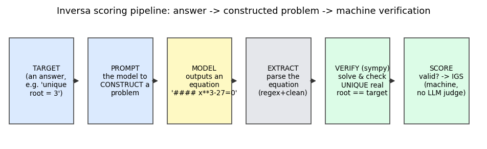

# Inversa

> A **contamination-resistant, self-scaling, machine-verified** benchmark of mathematical ability —
> measured not by *solving* problems but by **constructing** them (given an answer, build a problem
> that yields it). Scored by a sympy oracle with **no LLM judge**.

기존 벤치마크는 "AI가 문제를 **푸는가**"(문제→답)를 잰다. 그런데 공개 시험셋은 학습 데이터에 **유출(오염)** 되어 점수가 부풀려지고, 모델이 강해지면 **포화**된다. Inversa는 **역방향** — "답을 주면 그 답을 낳는 *문제를 구성*할 수 있는가"(답→문제) — 를 잰다. 즉석 무작위 입력으로 문제를 만들게 하므로 **오염될 고정 문항이 없고**, 난이도를 **프로그램으로** 올릴 수 있다. 점수는 **Inversa Generative Score (IGS)** — sympy로 기계 검증, 주관·LLM 심판 없음.

---

## 핵심 결과 (요약 — 전 과정은 [`docs/paper/inversa-paper.ko.md`](docs/paper/inversa-paper.ko.md))

전부 이 저장소의 실제 측정값이며 `data/results/`에 있다.

- **forward는 오염으로 부풀려진다 (우리 데이터):** GSM8K(유출) vs GSM-Symbolic(신선·동일난이도) = **+3.2%**, 95% CI [+1.0, +5.7], 9개 중 8개 모델 양수. 반면 역과제는 **체계적 격차 없음**(+0.0%, [−10.5, +11.0]) — 설계상 오염 불가.
- **IGS는 검증된 능력 측정기다:** 어려운 비포화 forward 벤치(AIME)와 **Spearman +0.93** [+0.65, +1.0] 일치 → 같은 수학 능력을 잰다. *별개 능력은 아니며*(원래 가설 반증), 그 가치는 **오염 면역 + 자동 확장 + gold-standard 일치**라는 구조적 우위.
- **난이도는 스스로 확장된다:** 구성 난이도를 올리면(뫼비우스 → r²·r³ → r⁴·합성) 상단 천장이 깨져 **어떤 모델도 100%에 도달 못 함**(최강 opus-4.8도 88%). 검증 가능 수학 한계 안에서 프런티어까지 변별.
- **거대 리더보드 (정밀 30문항 종합본):** OpenRouter 카탈로그(텍스트 346개 → 후보 197개 → 시도 102개)를 **30문항 pose + 30문항 transform**·**temperature 0**(결정적)으로 측정 → **59개 모델 / 7개 패밀리 완주**(IGS **0.18~1.00**). 6문항 표준 은행보다 pose 변별이 정밀(1/30 단위)해 상단 동률이 5개→**3개**로 좁혀졌다. 대시보드: [`data/results/igs_dashboard.html`](data/results/igs_dashboard.html).

### 리더보드 상위 (정밀 30문항 IGS, 발췌)
| # | 모델 | IGS |
|---|---|---|
| 1~3 (1.0 동률) | openai/gpt-5-mini · openai/gpt-5 · qwen/qwen3-max | 1.00 |
| 4 | openai/gpt-oss-120b | 0.98 |
| 5 | openai/o4-mini | 0.98 |
| 6 | anthropic/claude-haiku-4.5 | 0.98 |
| 7 | deepseek/deepseek-r1 | 0.98 |
| 9 | anthropic/claude-opus-4.8 | 0.97 |
| 10 | google/gemini-3.5-flash | 0.97 |
| … | … | … |
| 59 | qwen/qwen3-8b | 0.18 |

전체 순위: [`data/results/igs_leaderboard_30.json`](data/results/igs_leaderboard_30.json) / 대시보드: [`data/results/igs_dashboard.html`](data/results/igs_dashboard.html).

> **이 종합본의 범위·신뢰도(정직):** 단일 패스(반복 1회, temp 0). 이번 패스는 계정 크레딧이 중간에 소진돼 **후순위 43개 모델**(meta-llama·x-ai·minimax·moonshot·cohere·amazon·nvidia 등 패밀리 + provider 비호환분)이 **미측정** — 엔진은 계정 차원 오류를 감지하면 즉시 중단하고 캐시를 저장하므로, 크레딧 충전 후 같은 `--cache`로 **이어서 완주** 가능. 추론·대형 모델 10개는 `#### 식` 전에 잘려(truncation) **신뢰도 낮음**(특히 z-ai/glm-5는 60문항 중 27문항만 측정) — 대시보드에 표시됨.

---

## 빠른 시작 — 벤치마크 엔진

```bash
# .env 에 OPENROUTER_API_KEY 저장 후
python -m inversa.cli_bench --models "anthropic/claude-opus-4.8,openai/gpt-4o-mini,..." \
       --max-tokens 8000 --reasoning-max-tokens 4000 --max-workers 8
# -> data/results/igs_benchmark.{json,html} : 순위 IGS + 문항별 증거(글라스박스) + 모델별 토큰 usage
```

- `--models` 쉼표 구분. `--max-workers` 동시도. 중간에 끊겨도 같은 `--cache`로 재실행하면 이어서 진행.
- 점수 = **IGS = mean(pose validity, transform validity)**. 둘 다 sympy 유일근 검증.
- **오염 면역 pose:** `--pose-random N` 으로 pose 타깃을 *고정 뱅크 대신 매 실행 새로 생성*(시드·타깃은 결과 JSON에 기록). 유출될 고정 문항이 없어 pose 축도 transform 축처럼 오염 불가가 됨.
- **자명형 차단(anti-gaming):** `--pose-no-trivial` 로 `x = target` 같은 1차식 복붙을 무효 처리 → 차수 ≥ 2 또는 비다항식의 *진짜 구성*만 인정(옵트인; 기본은 비교성 위해 OFF).

### ⚠️ 추론(reasoning) 모델 주의 — 토큰 예산이 점수와 비용을 좌우
추론 모델은 내부 추론이 출력 토큰 예산을 먹는다. 예산이 작으면 OpenRouter provider가 두 갈래로 갈린다(실측):
- **max_tokens를 지키는 provider**(예: minimax-m1): 추론이 예산을 다 써 `#### 식` 줄 전에 잘려(`finish_reason=length`, 빈 응답) → **점수가 가짜로 0에 수렴**. → `--max-tokens`를 충분히(기본 8000) 줄 것.
- **max_tokens를 무시하는 provider**(예: deepseek-r1): 추론이 무제한으로 돌아 **설정의 3~4배 토큰을 청구**. `--reasoning-max-tokens`는 이를 지원하는 provider에서만 상한이 걸리고, 순수 추론 모델(끌 수 없음)에는 안 듣는다 — 대신 결과 JSON의 모델별 `usage`(completion·reasoning 토큰, `truncations`)로 폭주·잘림을 **눈으로 확인**하고 제외 여부를 판단할 것.
- 콘솔 `[done]` 줄과 종료 요약에 토큰 지출/truncation 경고가 찍힌다.
- `--truncation-missing` 으로 잘린(truncation) 문항을 **오답이 아니라 결측**으로 처리(분모에서 제외) → 예산 부족이 추론 모델 점수를 거짓으로 깎는 것을 방지(옵트인).

### ⚙️ 시스템 자원 (RAM)
대규모 병렬 측정(예: ~100개 모델 동시)은 sympy 검증 워커·HTTP 클라이언트가 메모리를 점유한다. **피크 시 시스템 RAM 약 8–10GB**(가용 최대치 범위 내)를 사용하도록 운영했다. RAM이 부족한 환경에서는 `--max-workers`를 낮추거나(예: 4~6) 모델을 배치로 나눠 실행할 것. (워커를 과도하게 높이면 sympy의 GIL-점유 검증이 동시에 겹쳐 프로세스가 멈출 수 있으므로 6~12 권장.)

---

## 작동 원리 (한눈에)



1. **타깃(답)** 을 주고 → 2. 모델에게 **문제 구성**을 시키고 → 3. 모델이 `#### x**3-27=0` 식을 출력 →
4. **추출**(마커/파싱/LaTeX·유니코드 정리) → 5. **sympy 검증**(유일 실근 == 타깃?) → 6. **IGS 채점**.

상세 메커니즘(실제 프롬프트·출력 예·채점 worked example)은 논문 §2 참고.

---

## 한계 (정직)

- N 중간 규모, 일부 동률 → 상관에 부트스트랩 CI를 붙였으나 폭은 넓다.
- 단일 도메인(단변수 대수); 도메인 일반화·외부 예측타당도 미검증(논문 §4.3 E4/E5).
- 정밀 30문항 종합본은 단일 패스(반복 1회)이며, 미측정 43개는 패스 도중 계정 크레딧 소진(후순위 패밀리 절단) + provider 비호환(non-serverless·404·엔드포인트)·추론모델 latency 때문 — 캐시 resume으로 완주 가능(측정 한계로 표기). 추론·대형 10개는 truncation으로 신뢰도 낮음.
- 일부 초월식 검증은 sympy GIL-행 위험(타임아웃+수치 폴백으로 완화, 고동시도 시 워커 수 주의).

---

## 문서 · 재현성

- **논문:** [`docs/paper/inversa-paper.md`](docs/paper/inversa-paper.md) (영문 정본) · [`docs/paper/inversa-paper.ko.md`](docs/paper/inversa-paper.ko.md) (한국어)
- **핵심 코드:** `tasks/structural.py`(구성 과제) · `verifiers/math_equation.py`(검증 오라클) · `scoring.py`(IGS) · `cli_bench.py`(엔진)
- **실험 스크립트:** `scripts/run_forward_gap.py`(오염), `run_e10.py`(AIME 변별), `run_transform_hard.py`+`gen_transform_*`(난이도 확장), `make_figures.py`(그림)
- **테스트:** 191개 단위테스트(검증기·채점·추출·엔진). `data/banks/` 문제은행, `data/results/` 결과.

**참고문헌:** GSM-Symbolic (Mirzadeh et al., Apple, ICLR 2025, arXiv:2410.05229) · GSM1k (Zhang et al., Scale AI, 2024, arXiv:2405.00332) · arXiv:2311.04850.
