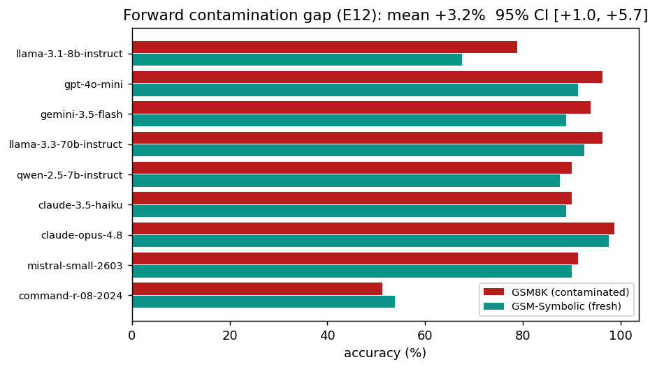
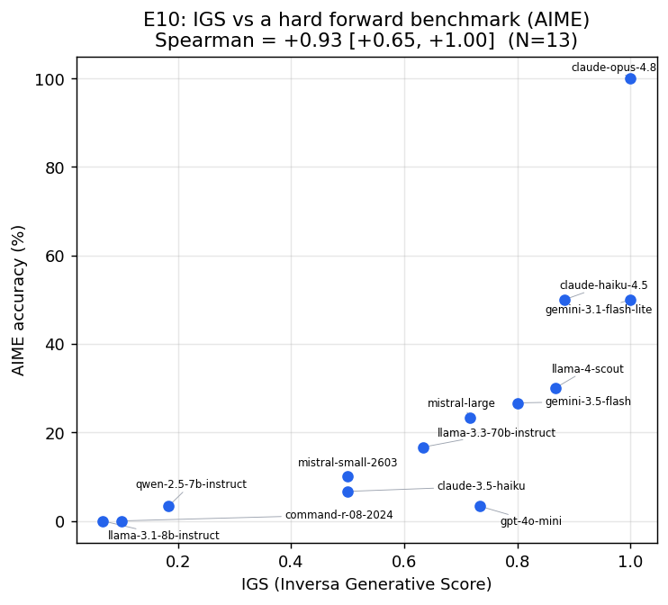
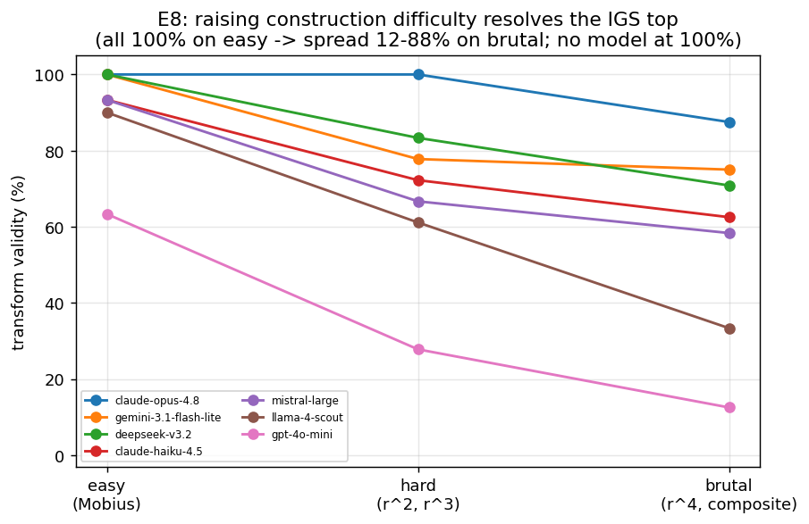
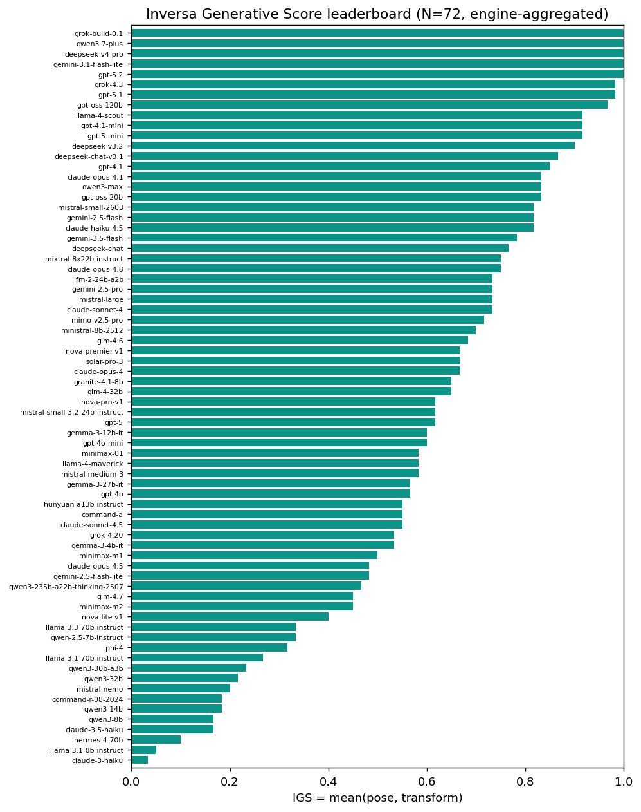

# Inversa: A Contamination-Resistant, Self-Scaling Benchmark of Mathematical Ability via Problem *Construction*

*Working paper — all numbers are real measurements from this repository (branch `scoring-validity`).
Figures are generated from the result files by `scripts/make_figures.py`.*

---

## Abstract

Standard AI math benchmarks ask a model to **solve** a problem (problem → answer). Two well-known
weaknesses follow: (1) fixed public test sets **leak into training**, inflating scores above genuine
reasoning (*contamination*), and (2) each benchmark eventually **saturates** as models improve,
forcing ever harder human-authored problems. We study the **inverse** task — given an answer, ask the
model to **construct a problem** that yields it — and ask whether it is a more trustworthy basis for
measurement. We define a machine-verified score, the **Inversa Generative Score (IGS)**, computed
with a sympy oracle and **no LLM judge**. Across 22 models from 8 families we find: (i) forward
scores are measurably inflated by contamination on our own models (**+3.2%**, 95% CI [+1.0, +5.7];
GSM8K vs the fresh GSM-Symbolic), whereas the inverse task shows **no systematic gap** (+0.0%,
[−10.5, +11.0]) and is contamination-immune by construction; (ii) IGS **strongly agrees** with a
hard, non-saturated forward benchmark (AIME) — **Spearman +0.93** [+0.65, +1.0] — so it is a
*validated measure of math ability*, **not** a distinct capability (the original "generation ≠
solving" hypothesis is refuted) — and a **discriminant** test (E13) shows this agreement is
*math-specific*, not mere general capability: IGS tracks AIME far more than a hard non-math logic
control (ρ +0.93 vs +0.66, Williams p<0.05; partial ρ +0.88); (iii) IGS difficulty is **self-scaling**: raising construction
difficulty (Möbius → polynomial → degree-4/composite root transforms) breaks the top ceiling so that
**no model reaches 100%** (the best, opus-4.8, tops out at 88%). We report several hypotheses we
tested and **rejected** along the way. Conclusion: problem construction is not a *separate* ability,
but it is a **contamination-resistant, auto-scaling, machine-verified way to measure the same math
ability that gold-standard forward benchmarks measure** — its durable advantage is structural, not a
new axis.

---

## Part 1 — 起 / Setup: why look at the inverse of solving

### 1.1 Two problems with "solve the problem" benchmarks

A forward benchmark gives a problem and grades the model's answer. This is the dominant paradigm
(GSM8K, MATH, AIME, …). It has two documented failure modes:

- **Contamination.** Public test sets are posted online and ingested during pre-training. The model
  can then score well by *recall* rather than reasoning. This is established empirically: GSM1k
  (Zhang et al., Scale AI, 2024, arXiv:2405.00332) built a fresh GSM8K-parallel set and found an
  overfitting gap up to **13%** for some model families; a single test-set replica in pre-training
  drastically lowers MATH loss; rephrased-sample contamination evades n-gram detection
  (arXiv:2311.04850).
- **Saturation / the treadmill.** As models improve, each benchmark's top fills with near-100%
  scores and can no longer rank the best models — like a 100-cm ruler that cannot tell apart people
  taller than 100 cm. The field responds by authoring harder benchmarks (AIME → FrontierMath), an
  expensive human treadmill, and each new benchmark eventually leaks too.

### 1.2 The idea

Reverse the direction. Instead of *"here is a problem, give the answer,"* ask *"here is the answer,
construct a problem that has it."* Two intuitions motivate this:

- A problem **constructed fresh at test time cannot be contaminated** — there is no fixed item to
  leak.
- Construction difficulty can be **raised programmatically** (compose transforms, add constraints)
  rather than by human authoring.

The empirical questions are whether construction is (a) *real* (not itself recall), (b) *measurable
and consistent*, (c) a *trustworthy* and *durable* basis for ranking models. The rest of this paper
tests these directly — including hypotheses that turned out to be **wrong**.

### 1.3 Hypotheses and verdicts (roadmap)

| # | Hypothesis | Verdict | Evidence |
|---|---|---|---|
| H1 | Forward scores are inflated by contamination | **Supported** | E12: +3.2% [+1.0,+5.7], 8/9 models |
| H2 | The inverse task is recall-resistant | **Supported** | structural + E12b: +0.0% [−10.5,+11.0] |
| H3 | Inverse "generation" is a capability **distinct** from solving (θ_gen ⟂ θ_solve) | **Rejected** | E10: IGS↔AIME +0.93 (it *tracks* ability) |
| H4 | Forward benchmarks are saturated **in general** | **Rejected / scoped** | hard forward (AIME) is not saturated |
| H5 | Forward solving here is *not* memorized (early over-claim) | **Rejected** | weak test; corrected by H1/E12 |
| H6 | IGS measures the same ability as a gold-standard hard forward test | **Supported** | E10: +0.93 [+0.65,+1.0] |
| H7 | IGS difficulty can be scaled to discriminate the frontier | **Supported** | E8: ceiling broken, opus 88% |
| H8 | IGS is math-*specific*, not merely general capability (g) | **Supported** | E13: ρ(IGS,AIME)=.93 ≫ ρ(IGS,non-math logic)=.66, Williams p<.05; partial .88 |

The honest narrative is: the *strong* form of the original vision (a brand-new ability axis) is
**false**, but a *more defensible* form (a contamination-proof, self-scaling, validated measure)
**holds**.

---

## Part 2 — 承 / Method: exactly how Inversa works

This section is deliberately concrete so a first-time reader can see every step: what we send the
model, what it returns, and how a machine (not a human, not another LLM) decides if it is correct.


### 2.1 The two construction tasks

**Task A — "Pose" (construct from a target).** We give the model a target *answer* and ask it to build
an equation whose **unique** real solution is exactly that target. The exact prompt is:

```
Construct a single-variable equation in x whose UNIQUE real solution is exactly {target}.
There must be no other real solution. Radicals, fractions, exponentials and logs are allowed
and encouraged.
You may reason first, but you MUST end with the equation on its own final line, prefixed by
'#### ', in sympy syntax. Example: '#### x**2 - 2 = 0'.
```

Targets range from easy (`3`) to deliberately un-memorizable (`sqrt(2) + 1`, `the real root of
t**3 - t - 1 = 0`, `sqrt(2) + sqrt(3)`). Why irrational targets matter: the obvious template for
`sqrt(2)+1` is its minimal polynomial `x**2 - 2x - 1 = 0`, but that **also** has the conjugate root
`1 - sqrt(2)` → it fails "unique," so a model must genuinely construct (e.g. `x = sqrt(2) + 1`, or a
domain-restricted form), not pattern-match.

Pose targets can be drawn from a fixed bank *or* generated **fresh at test time** (`--pose-random N`):
the engine samples random irrational/structural targets (each target's value is computed by sympy
from the same symbolic form that describes it, so the description cannot drift from the answer), and
records the seed + generated targets in the output. This makes the pose axis **contamination-immune
like the transform axis** — with fresh targets there is no fixed (target → good-equation) pair to
leak — closing the one asymmetry where a *fixed* pose bank could in principle be memorized once public.

A second hardening, `--pose-no-trivial`, blocks **gaming**: a linear equation `x = target` is *correct
but not construction* (it just restates the answer), so the verifier flags any degree-1-in-x answer
(`trivial`) and strict mode scores it invalid — forcing degree ≥ 2 or a non-polynomial form where the
target emerges as the unique real root. The effect is large (a small probe halved a frontier-mini
model's permissive pose validity once restatements were excluded), which means permissive pose is
partly inflated by answer-copying; we therefore report it as an **opt-in** rigor mode (the headline
runs used permissive scoring, so their pose half should be read with this caveat).

**Task B — "Transform" (the recall-proof core).** We generate a **random** cubic with one ugly
(irrational) real root *r*, show it to the model, and ask it to build a *new* equation whose unique
real solution is a function *g(r)* — without computing *r* numerically. Exact prompt:

```
Let r be the UNIQUE real solution of this equation:
{source}                                   e.g.  x**3 + x - 1 = 0
Do NOT solve for r numerically. By transforming the structure, construct a NEW single-variable
equation in x whose unique real solution is exactly {g}  (where r is that solution above).
You may reason first, but you MUST end with the new equation on its own final line prefixed by
'#### ', in sympy syntax. Example: '#### (x-1)**3 + (x-1) - 1 = 0'.
```

For `g = r + 1` the structural answer is the substitution `x → x − 1`: `(x-1)**3 + (x-1) - 1 = 0`.
Because the source is **random** and *r* is irrational, **no memorized problem can supply the answer**
— the output must be a function of the input shown at test time. This is what makes Task B
contamination-proof by construction.

### 2.2 Extracting the equation from the reply

Models reply in varied formats. `extract_equation` (in `tasks/posing.py`) is robust:

1. Prefer the text after the last `####` marker.
2. Otherwise take the **last line that actually parses** as an equation.
3. Clean cosmetic noise: strip LaTeX (`$`, `\(`), code fences, a leading `Final:`/`f(x) =` label;
   convert `^` → `**` (sympy reads `^` as XOR); normalize unicode (`x³` → `x**3`, `−`/`×`/`√`).
4. If the reply contains no parseable equation, **re-prompt once** for just the bare equation.

This matters: without it, a correct-but-verbose model is scored as a false zero (we observed a model
drop to 0% purely from format non-compliance before this fix).

### 2.3 Verification — a sympy oracle, no LLM judge

`verify_equation(equation, target)` (in `verifiers/math_equation.py`) decides correctness mechanically:

1. **Parse** `lhs = rhs`. Split on a single `=`; reject inequalities and relational syntax
   (`Eq(...)`). Parse each side with sympy's `parse_expr` in a **sandbox** (`__builtins__` removed)
   so untrusted model output cannot execute code.
2. **Require x to be present** (reject equations that do not constrain x).
3. **Solve** `sp.solve(lhs - rhs, x)` under a **10-second timeout** (a daemon thread; sympy can
   otherwise hang forever on adversarial input — this once stalled a run for 46 minutes).
4. Keep the **real** solutions. `valid` = the target is among them; `unique` = the real solution set
   is exactly `{target}` (within 1e-6).
5. **Numeric fallback.** If symbolic solving cannot confirm the target (e.g. a transcendental
   embedding like `exp(x**3 - x - 1) = 1`), evaluate the function on a grid + bisection to confirm
   membership and count real roots. This rescues valid constructions sympy cannot symbolically solve.

A worked example. Model output `Reasoning…\n#### x**3 - 27 = 0`, target `3`: extract →
`x**3 - 27 = 0`; solve → roots `{3, complex, complex}`; real roots `{3}`; `valid = True`,
`unique = True` → **counts**. Output `x**2 - 9 = 0`, target `3`: real roots `{3, -3}` →
`unique = False` → **does not count** (it also solves to −3). Everything is reproducible and
inspectable; the suite has **191 passing unit tests** (verifier, scoring, extraction, and the
benchmark engine) — run `python -m pytest -q`.

### 2.4 The score: IGS

For a model we run a fixed bank of pose targets and transform items and compute two validity rates,
each in [0, 1]:

- **pose validity** = fraction of pose items meeting the *unique-solution* constraint;
- **transform validity** = fraction of transform items whose unique real root equals *g(r)*.

> **IGS = mean(pose validity, transform validity).**

IGS is **generative-only**; forward solving is never part of it (it is reported separately as a
saturation reference). The benchmark engine is `python -m inversa.cli_bench --models ...`, which
outputs a ranked IGS leaderboard (JSON + HTML) with full per-item evidence.

**Interval scaling (optional).** Raw IGS is an *ordinal* index — a 0.9-vs-0.8 gap is not metrically
equal across the range, and pose/transform are pooled with arbitrary equal weight. `scripts/build_irt.py`
recovers the model×item correctness matrix from the run cache and fits a **Rasch (1PL)** model,
placing each model on an interval **logit θ scale** (P(correct) = σ(θ−b)) with a difficulty *b* and a
point-biserial discrimination per item. θ is a *monotone* rescaling of IGS (Spearman θ-vs-IGS =
**+1.00** on the N=46 complete-case run), so the **ranking is unchanged** but the spacing becomes
meaningful — the saturated 0.98→1.00 top compresses into a large θ gap near the ceiling — and pooling
the two item types into one matrix drops the 50/50 weight. Output: `data/results/igs_irt.json`. (We
report IGS as the headline for readability and θ as the metrically-honest companion.)

### 2.5 Models, data, infrastructure

- **22 models, 8 families** (Anthropic, OpenAI, Google, Meta, Mistral, DeepSeek, Qwen, Cohere,
  Amazon), weak (llama-3.1-8b, command-r) through frontier (opus-4.8, qwen3.7-plus, deepseek), via
  OpenRouter. Per-run N varies (12–22) as the roster grew and rate limits dropped individual models.
- **Banks** (all sympy-verified unique): pose targets, transform items (random ugly-root cubics ×
  {affine, reciprocal, Möbius} maps), plus harder polynomial transforms for §5.4. Forward
  comparisons use **GSM8K** and **GSM-Symbolic** (HuggingFace) and **AIME 2024+2025**.
- Runs write results **incrementally** and enforce an overall deadline, so a hang or a network drop
  never discards completed models.

---

## Part 3 — 轉 / Findings (and where the story turned)

### 3.1 Forward scores ARE inflated by contamination (H1) — and our first over-claim (H5)

We first ran a weak self-made perturbation test (number-swaps on self-authored algebra) and *wrongly
concluded* forward solving was "genuine, not memorized." That was a mistake: self-authored items
**cannot** be contaminated, so finding no gap was uninformative. We corrected it with the proper test:

For 80 templates we compared accuracy on the **GSM8K original** (in training corpora = contaminated)
vs the matched **GSM-Symbolic** instantiation (same difficulty, fresh numbers, canary-marked). The
gap is forward score inflation.



**Result (N=9): mean gap +3.2%, 95% CI [+1.0%, +5.7%] (excludes 0); 8 of 9 models positive.** Largest
for the weakest model (llama-3.1-8b **+11%**), small for the frontier (opus, mistral-small **+1%**) —
exactly the model-dependent pattern GSM1k reports. So **H1 holds on our own models**: seeing the exact
items inflates forward scores. (We *scope* this honestly: the effect is real but modest and uneven;
we do **not** claim forward scores are broadly "fake.")

**Direct evidence** (`data/results/forward_gap_results.json`; gap = GSM8K − GSM-Symbolic accuracy):

| model | GSM8K | GSM-Symbolic | gap |
|---|---|---|---|
| llama-3.1-8b-instruct | 78.8% | 67.5% | **+11.2%** |
| gpt-4o-mini | 96.2% | 91.2% | +5.0% |
| gemini-3.5-flash | 93.8% | 88.8% | +5.0% |
| llama-3.3-70b-instruct | 96.2% | 92.5% | +3.7% |
| qwen-2.5-7b-instruct | 90.0% | 87.5% | +2.5% |
| claude-3.5-haiku | 90.0% | 88.8% | +1.3% |
| claude-opus-4.8 | 98.8% | 97.5% | +1.3% |
| mistral-small-2603 | 91.2% | 90.0% | +1.2% |
| command-r-08-2024 | 51.2% | 53.8% | **−2.5%** |

Independently recomputed from the file: mean **+3.19%**, 8/9 positive, 95% bootstrap CI **[+1.0, +5.7]**
(20k resamples, seed 0) — matching the stored `summary`. See Appendix V.

### 3.2 The inverse task has no contamination gap (H2)

By construction, Task B uses randomized inputs, so no fixed item can leak. Empirically (E12b), we
compared transform validity on **familiar/textbook** source equations (∛2, the plastic number,
Newton's `x³−2x−5`) vs **random** sources: **mean gap +0.0%, 95% CI [−10.5%, +11.0%]** (N=7) — no
systematic familiarity advantage. The CI is wide (small sample), so the **structural** argument is
primary and the measurement is corroborating. The head-to-head is the asymmetry: **forward +3.2%
(CI excludes 0) vs inverse +0.0% (CI includes 0).**

**Direct evidence and an honest caveat** (`data/results/inverse_gap_results.json`; gap = familiar −
random source equations):

| model | familiar | random | gap |
|---|---|---|---|
| claude-3.5-haiku | 0.37 | 0.10 | **+26.7%** |
| llama-3.3-70b-instruct | 0.77 | 0.67 | +10.0% |
| claude-opus-4.8 | 1.00 | 1.00 | 0.0% |
| gpt-4o-mini | 0.60 | 0.60 | 0.0% |
| gemini-3.5-flash | 0.90 | 0.97 | −6.7% |
| qwen-2.5-7b-instruct | 0.30 | 0.37 | −6.7% |
| llama-3.1-8b-instruct | 0.07 | 0.30 | **−23.3%** |

The mean (+0.0%) is a **cancellation of large opposite per-model swings** (−23% … +27%), not tight
agreement: with N=7 models × 30 items the per-model rates are noisy. Honesty demands flagging the
claude-3.5-haiku outlier (+26.7%) — if it were not noise it would be a *familiarity advantage* for that
one model. This is exactly why the **structural** argument (Task B pins the output to a randomized
test-time input → there is no fixed item to leak) is the load-bearing claim; E12b only *corroborates*
that the structure behaves as designed at the population level, and should not be read as a
tight-CI null. Independently recomputed: mean **+0.00%**, CI **[−10.5, +11.0]** (Appendix V).

### 3.3 The big turn: IGS is *not* a separate ability — it agrees with a hard forward test (H3 rejected, H6 supported)

Our original vision claimed problem-construction is a **distinct** capability that *dissociates* from
solving. To test it we needed a hard forward benchmark that is **not** saturated, and compared the
model rankings. We used **AIME 2024+2025** (integer answers → exact grading; frontier models range
widely).



**Result (N=13): Spearman(IGS, AIME) = +0.93, 95% CI [+0.65, +1.0].** This is the central turn of the
paper:

- The **strong** hypothesis (H3, "generation is a separate axis") is **rejected** — a +0.93 rank
  correlation means IGS *tracks* general math ability, it does not measure something orthogonal.
- The **useful** hypothesis (H6) is **supported** — IGS ranks models almost identically to a
  gold-standard, expensive, human-authored hard benchmark. IGS is therefore a *validated measure of
  math ability*.

We also reject **H4** ("forward saturates in general"): AIME is *not* saturated — it discriminates
models with large headroom. So Inversa's value cannot be "forward is dead"; its value is being a
**contamination-immune, auto-generated** route to the same ranking.

**Direct evidence** (`data/results/e10_results.json`; AIME = accuracy on 60 problems, AIME 2024+2025,
graded by exact integer match via `scripts/run_e10.py` over `data/banks/aime_set.json`):

| model | IGS | AIME |
|---|---|---|
| claude-opus-4.8 | 1.00 | 100% |
| gemini-3.1-flash-lite | 1.00 | 50% |
| claude-haiku-4.5 | 0.88 | 50% |
| llama-4-scout | 0.87 | 30% |
| gemini-3.5-flash | 0.80 | 27% |
| **gpt-4o-mini** | **0.73** | **3%** |
| mistral-large | 0.72 | 23% |
| llama-3.3-70b-instruct | 0.63 | 17% |
| mistral-small-2603 | 0.50 | 10% |
| claude-3.5-haiku | 0.50 | 7% |
| qwen-2.5-7b-instruct | 0.18 | 3% |
| command-r-08-2024 | 0.10 | 0% |
| llama-3.1-8b-instruct | 0.07 | 0% |

**Honest reading of ρ = +0.93.** The correlation is **range-dominated**: it is anchored by the very weak
models (≈0 on both axes) and the frontier (≈1 on both), so +0.93 *overstates* the agreement in the
discriminating middle. Two facts temper the headline: (i) the **CI lower bound is +0.65** (N=13, and the
upper bound is pinned at 1.0 by the percentile bootstrap) — the defensible claim is "moderate-to-strong,"
not "near-identical"; (ii) there is a real **partial dissociation** — gpt-4o-mini constructs well
(IGS 0.73) yet barely solves AIME (3%), ranking ~5 places higher on IGS than on AIME. So H3 is rejected
only in its *strong* form (full orthogonality); construction and solving are *correlated but not
identical*, and the residual is itself informative. Independently recomputed Spearman = **+0.9253**
(Appendix V). The worry that this 0.93 is *just* the general-capability factor (g) is tested
head-on, and rejected, in §3.6.

### 3.4 Difficulty is self-scaling: breaking the top ceiling (H7)

On the easy transform bank the top **saturates** — three models tie at IGS 1.0, so the very top is
unmeasurable (the ruler is too short). Can we lengthen the ruler *within verifiable mathematics*? We
raised construction difficulty in two steps, each verifiable via the minimal polynomial:

- **hard:** polynomial transforms (root = r², r³) — require power-raising/elimination, not a single
  substitution;
- **brutal:** degree-4 / composite transforms (r⁴, r²+r, r³−r) — deeper elimination.



**Result:** each step resolves more of the top. On the brutal bank **no model reaches 100%** — the
best (opus-4.8) tops out at **88%**, with the field spread **12%–88%**. Recomputing IGS with the hard
transform (E10-redux, N=11) **fixes the top-resolution gap** that E10 found: the number of models tied
at the maximum drops from 2 to **1** (matching AIME), with **more** distinct levels (10 vs AIME's 9)
and rank-agreement maintained (**+0.89** [+0.47, +0.99]). (These redux numbers are not stored as a file
but are deterministically recomputed from the committed `transform_hard_results.json` + `e10_results.json`
by `python scripts/e10_redux.py` — no API — and verified to match exactly; Appendix V.) The reordering
is informative, not uniform:
models that do simple substitution but not elimination collapse (llama-3.3-70b 77% → 6%), showing the
hard bank measures a *deeper* construction skill.

Thus the construction axis has real **headroom above saturation**, reachable programmatically and
within the verifiable-math limit — the key to future-proofing (§4.3). One caveat: separating the very
top two (opus vs qwen3.7-plus) was **not** achieved, because qwen3.7-plus (a slow reasoning model)
times out on the hard bank; this is an infrastructure limit, not a limit of the method.

### 3.5 The engine-aggregated leaderboard (N=59, finer 30-item banks)

We ran the benchmark engine (`cli_bench`) over a tier-balanced roster drawn from the live OpenRouter
catalogue (346 text models → 197 serious candidates → 102 attempted), scoring each on a **finer
30-item pose bank and 30-item transform bank** at **temperature 0** (deterministic scoring; a
reasoning-token budget of 4000 caps spend). This finer bank supersedes the earlier coarse 6-item
"standard" pose bank: pose validity now resolves in 1/30 increments rather than 1/6, so models
separate on the pose axis itself rather than needing a hard-bank tiebreak.



**59 models across 7 families completed (IGS 0.18 → 1.00).** Three models top the bank at IGS 1.0
(gpt-5-mini, gpt-5, qwen3-max) — a far tighter ceiling than the coarse bank's five-way tie, confirming
the finer bank's higher resolution. Transform validity saturates near 1.0 for strong models while pose
validity spreads 0.23 → 1.00, so the pose axis carries the discrimination. Weak open models
(qwen3-8b 0.18, claude-3-haiku 0.22) anchor the bottom.

**Coverage and reliability (honest).** This is a single pass (one repeat, temperature 0). The account's
credit was exhausted partway through the pass; the engine detects an account-wide failure, aborts
cleanly, and persists its cache, so the run is **resumable from disk** — but the remaining 43 of 102
went unmeasured: the later-roster families (meta-llama, x-ai, minimax, moonshot, cohere, amazon,
nvidia, …) were cut off, alongside the usual provider-incompatible (non-serverless / 404 / unsupported
endpoint) models. Ten reasoning/large models truncated before emitting their final equation (their pose
scores are low-confidence — e.g. glm-5 was scored on only 27 of 60 items); these are flagged in the
dashboard. Full ranking and coverage accounting: `data/results/igs_dashboard.html` and
`igs_leaderboard_30.json`. Completing the roster is a credit-bound re-run with the same `--cache`
(already-measured models are skipped, so only the unmeasured set is paid for).

### 3.6 Discriminant validity: IGS measures *math*, not just general capability (H8)

A high IGS↔AIME correlation (§3.3) is necessary but not sufficient to call IGS a *math* measure:
strong models tend to be strong at everything (a large general-capability factor, g), so almost any
two benchmarks correlate across a wide model range. The convergent result alone cannot tell "IGS is a
math test" from "IGS is a g-meter." So we test **discriminant validity** — does IGS track AIME (math)
*more* than a non-math axis? We ran the same E10 models on a HARD non-math control: 18 deductive
**logic** ordering puzzles (no arithmetic; the prose and the answer key are generated from one
constraint spec and the unique answer is **brute-force-verified**, so the key is correct by
construction — `data/banks/nonmath_logic.json`). Crucially the control **spreads** the field (50%–100%),
so it is a usable capability axis — unlike a factual-knowledge control, which these models saturate
(we tried; even an obscure-facts bank left the field at 92%–100%, an invalid degenerate control).

**Result (N=13):** ρ(IGS, AIME) = **+0.93**, but ρ(IGS, logic) = **+0.66** [+0.17, +0.81]; the
general-capability baseline ρ(AIME, logic) = +0.79. IGS↔AIME *exceeds* both and survives partialling
out the logic axis: partial ρ(IGS, AIME | logic) = **+0.88**. The 0.93-vs-0.66 gap is **statistically
significant** despite the small sample (Williams's test for two dependent correlations, t = 3.49,
df = 10, p < 0.05). The mechanism is visible in the weak tail: **llama-3.1-8b solves the logic puzzles
reasonably (78%) yet scores ≈0 on both IGS and AIME** — it can reason, but it cannot construct or solve
*mathematics*, and IGS tracks the latter. So both extremes are ruled out: IGS is **not** an orthogonal
new axis (H3 rejected: ρ=0.93 with AIME) **and not** merely general capability (H8 supported: it is
specifically mathematical). Caveats: N=13 (wide CIs); a single non-math control; the top 9 models
saturate the logic control, so the discriminant signal is carried by the lower-ability range;
Williams's test applies a Pearson approximation to Spearman ρ. Source/reproduce:
`python scripts/run_discriminant.py --bank data/banks/nonmath_logic.json` →
`data/results/discriminant_results.json`.

---

## Part 4 — 結 / Conclusion

### 4.1 What Inversa is — and is not

- **Is:** a **machine-verified** (sympy, no LLM judge), **contamination-resistant** (forward +3.2% vs
  inverse ≈0), **self-scaling** (Möbius → r² → r⁴ breaks the ceiling), **validated** (ranks like AIME,
  ρ=0.93) measure of mathematical ability.
- **Is not:** a *new, separate* capability (H3 rejected — it tracks general ability), nor inherently a
  *sharper* discriminator than a hard forward benchmark (comparable at matched difficulty).
- **Durable advantage (structural):** *verifying* a constructed problem is cheap even when
  *constructing* it is hard (a P-vs-NP-style asymmetry). So harder Inversa items cost a few lines of
  code and stay contamination-free, whereas harder forward items require expensive human authoring and
  eventually leak.

### 4.2 Threats to validity (honest)

- Moderate N (12–22) with ties → correlations carry bootstrap CIs but remain wide.
- Single domain (univariate algebra); generality untested (→ §4.3).
- The contamination gap mixes leakage with surface-fragility (we did not separate them).
- The inverse-gap CI is wide; the structural claim is primary.
- Cheap verification holds for the *algebraic* regime; transcendental uniqueness can be expensive or
  undecidable (mitigated by timeouts + numeric fallback).
- Extreme-difficulty measurement is latency-bound for slow reasoning models (qwen3.7-plus).
- Reasoning models can **truncate** (budget exhausted before the `#### eq` line), which the headline
  runs scored as a wrong answer (a false zero that deflates the strongest models). `--truncation-missing`
  instead treats a truncated item as **missing** (excluded from the rate, not counted wrong); the
  adapter flags each truncated call and the missing items are reported, so the strict mode is opt-in.

### 4.3 What remains for a stronger paper

- **E4 — generality:** replicate beyond algebra (number theory, systems, proofs) to show the construct
  is not algebra-specific.
- **E5 — predictive validity:** show IGS predicts an external outcome (held-out hard set, expert
  ratings).
- **E2 — reliability:** test-retest stability and inter-task consistency.
- **Larger N** to tighten all CIs; separate the very top with one more difficulty rung.

### 4.4 One-sentence conclusion

> Problem *construction* is not a separate ability, but — because it is machine-verifiable,
> contamination-immune, and cheap to scale while a hard forward benchmark is not — it is a durable,
> trustworthy instrument that measures the same mathematical ability that gold-standard forward
> benchmarks measure, and keeps discriminating models as they improve.

---

## Reproducibility

Repository `wwoosshh/inversa-bench`, branch `scoring-validity`. Engine: `python -m inversa.cli_bench`.
Core: `tasks/structural.py`, `verifiers/math_equation.py`, `scoring.py`. Experiments:
`scripts/run_forward_gap.py` (E12), `run_inverse_gap.py` (E12b), `run_e10.py` + `e10_redux.py` (E10),
`run_transform_hard.py` + `gen_transform_{hard,brutal}_bank.py` (E8). Figures: `scripts/make_figures.py`.
All scores are sympy-verified; **191 passing unit tests** cover the verifier, scoring, extraction, and
the benchmark engine (`python -m pytest -q`). Result JSONs are under `data/results/`; banks under
`data/banks/`.

---

## Appendix V — Verification & reproduction (every headline number → its source → how to recompute)

Every quantitative claim in this paper was **independently recomputed from the committed result files**
(not merely read back from a stored `summary`), branch `scoring-validity`. The recomputation matches the
reported values to the stated precision. The table below lets a reader verify each claim *from this
document alone*: the source file, the exact stored value, the independently recomputed value, and the
command to regenerate it.

| Claim (§) | Source file under `data/results/` | Stored value | Independently recomputed | Reproduce |
|---|---|---|---|---|
| Forward gap **+3.2% [+1.0,+5.7]**, N=9, 8/9 positive (§3.1) | `forward_gap_results.json` → `summary` + `models[]` | mean_gap 0.0319; CI [0.0097, 0.0569]; n_positive 8 | mean **+3.19%**, 8/9, CI **[+1.0,+5.7]** (20k bootstrap, seed 0) | live: `python scripts/run_forward_gap.py`; check: `mean(c−f)` over `models[]` |
| Inverse gap **+0.0% [−10.5,+11.0]**, N=7 (§3.2) | `inverse_gap_results.json` → `summary` + `models[]` | mean_gap ≈0; CI [−0.105, +0.110] | mean **+0.00%**; per-model spread **−23%…+27%** | live: `python scripts/run_inverse_gap.py` |
| IGS↔AIME **ρ=+0.93 [+0.65,+1.0]**, N=13 (§3.3) | `e10_results.json` → `analysis` + `models[]` | 0.9253; CI [0.652, 1.0]; n 13 | Spearman **+0.9253** (avg-rank Pearson) | live: `python scripts/run_e10.py` (AIME from `data/banks/aime_set.json`, 60 problems) |
| E10-redux **+0.89 [+0.47,+0.99]**, N=11; ties 2→1; levels 10 vs 9 (§3.4) | *(not stored)* derived from `transform_hard_results.json` + `e10_results.json` | — | **+0.89**, tied_at_max **2→1**, distinct **10 vs AIME 9** | `python scripts/e10_redux.py` (no API; deterministic) |
| E8 brutal: opus **88%**, spread **12–88%**, none 100% (§3.4) | `transform_brutal_results.json` (`hard_transform_validity`) | opus 0.875; max 0.875; min 0.125 | opus **87.5%**, **12.5–87.5%** | inspect per-model field (7 models) |
| E8 hard: llama-3.3-70b **77%→6%** (§3.4) | `transform_hard_results.json` + `paper_level3_all.json` | easy 0.77 → hard 0.056 | **77% → 5.6%** | inspect per-model fields |
| Leaderboard **N=59, 7 families, IGS 0.18–1.0** (§3.5) | `igs_leaderboard_30.json`; `igs_dashboard_summary.json` | n_models 59; igs_min 0.183 | **59/102, 7 families** | `python -m inversa.cli_bench …`; `python scripts/build_dashboard.py` |
| Discriminant validity (E13, §3.6): ρ(IGS,AIME)=.93 ≫ ρ(IGS,logic)=.66, Williams t=3.49 p<.05, partial=.88 | `discriminant_results.json` (control `data/banks/nonmath_logic.json`) | strong_supported=true; williams_t 3.487; nonmath range 0.50 | re-derived: gap +0.27, partial +0.88, Williams t=3.49 | `python scripts/run_discriminant.py --bank data/banks/nonmath_logic.json` |
| Interval (Rasch) scaling (§2.4): θ monotone in IGS, θ-vs-IGS Spearman +1.00 (N=46) | `igs_irt.json` | n_models 46, n_items 60 | re-derived from the run cache, no API | `python scripts/build_irt.py` |
| Verifier soundness | `tests/` | — | **191 tests pass** | `python -m pytest -q` |

**Scope notes carried by the data (read with the numbers):** (i) §3.3's ρ is *range-dominated* — anchored
by very-weak and frontier models; the defensible figure is the CI lower bound (**+0.65**; redux **+0.47**),
and gpt-4o-mini (IGS 0.73 / AIME 3%) is a real partial dissociation. (ii) §3.2's inverse-gap mean is a
*cancellation* of ±25% per-model swings (N=7×30 items), so the **structural** argument is primary, not the
null CI. (iii) §3.4's ceiling-breaking and §3.5's leaderboard are partial coverage (7 brutal models with
qwen3.7-plus timed out; the 59-model leaderboard is a credit-limited single pass with 10 truncated,
low-confidence models flagged). All caveats are listed in §4.2.

**References.** GSM-Symbolic — Mirzadeh et al., Apple, ICLR 2025 (arXiv:2410.05229). GSM1k / "A Careful
Examination…" — Zhang et al., Scale AI, 2024 (arXiv:2405.00332). Rephrased-sample contamination —
arXiv:2311.04850.
